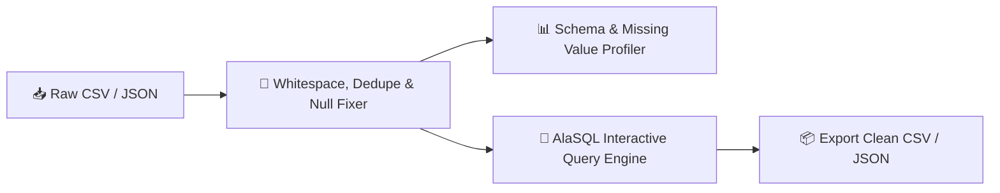

# 🧹 DataScrub & SQLBox AI

> **Zero-Backend In-Browser CSV/JSON Auto-Cleaner, Column Profiler & SQL Query Sandbox.**

```mermaid
flowchart LR
    A["📥 Raw CSV / JSON"] --> B["🧹 Whitespace, Dedupe & Null Fixer"]
    B --> C["📊 Schema & Missing Value Profiler"]
    B --> D["🧮 AlaSQL Interactive Query Engine"]
    D --> E["📦 Export Clean CSV / JSON"]
```
